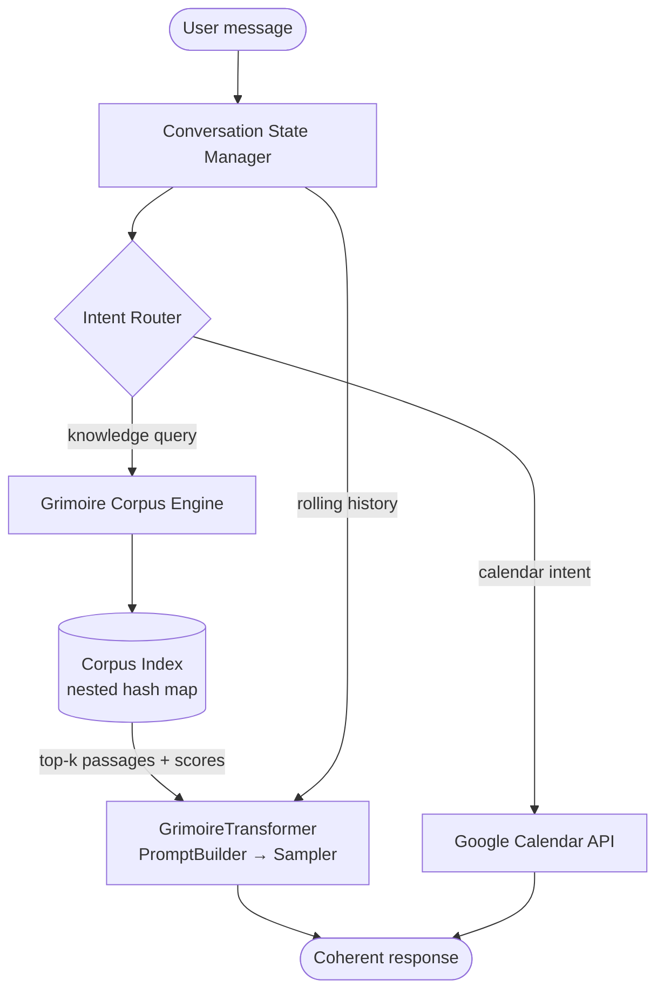

# Grimoire

**Grimoire** is a hybrid small language model (SLM) engine built from scratch, designed to run on a home machine with GPU acceleration. It pairs a corpus retrieval engine (based on dr. Vincent Granville's Radial Basis Function interpolator) with a scratch-built transformer LLM for coherent, context-aware response generation. The result is an agent engine that is accurate, explainable, and grounded in a defined corpus — no hallucination on domain facts.

Grimoire is intentionally domain-agnostic. Agents are configurations of the engine: each agent declares which corpora it uses, which tools it has access to, and its conversational persona. The engine stays the same.

The first agent built on Grimoire is **Saga**: a domain-specialised chatbot covering Dungeons & Dragons, mathematics, and data science, with Google Calendar integration.

## Goals

- Run on consumer hardware (CPU or CUDA GPU — no cloud required)
- Zero *domain* training cost: corpus retrieval handles facts; the LLM handles language and conversation flow
- Full conversational coherence with multi-turn context tracking
- Modular engine: swap corpora, agents, and tool integrations independently
- Deterministic, explainable retrieval grounded in a defined corpus — no hallucination on domain facts
- Built from scratch as a learning project: tokenizer, transformer architecture, training loop, and fine-tuning pipeline are all hand-written

## Repository Structure

```
grimoire/
├── grimoire/
│   ├── corpus/             # Corpus ingestion, stemming, multi-token indexing  ✓
│   ├── llm/                # Scratch-built transformer LLM                     ✓ (phases 1–4)
│   │   ├── tokenizer/      # Byte-level BPE tokenizer
│   │   ├── model/          # Decoder-only transformer (GQA, RoPE, SwiGLU, RMSNorm)
│   │   ├── data/           # TokenizedDataset, PaddingCollator, preprocessing
│   │   ├── training/       # Trainer, checkpointing, train entry point
│   │   └── inference/      # PromptBuilder, sampler, InferenceEngine           ✓
│   ├── rbf/                # Granville RBF retrieval engine                    planned
│   ├── state/              # Conversation state and rolling history            planned
│   ├── router/             # Intent detection and tool routing                 planned
│   └── tools/              # Tool integrations (Google Calendar, etc.)         planned
├── agents/
│   └── saga/               # Saga agent — D&D, math, data science, calendar    planned
├── data/                   # Corpus data files (gitignored)
├── tests/                  # Test suite
└── docs/                   # Architecture and API documentation
```

## Architecture

### Flow



### Component Roles

| Component | Role | Status |
|---|---|---|
| **Corpus Engine** | Ingests text, indexes stemmed 4-gram multi-tokens in a hash map, retrieves top-k passages by Jaccard similarity (RBF kernel in a later phase) | ✓ done |
| **BPE Tokenizer** | Byte-level Byte-Pair Encoding; vocab size 16 384; lossless round-trip for any Unicode input | ✓ done |
| **GrimoireTransformer** | Scratch-built decoder-only transformer (~25 M params); GQA, RoPE, SwiGLU, RMSNorm, weight-tied output head | ✓ done |
| **Training Pipeline** | AdamW + cosine-warmup LR, fp16 AMP, gradient accumulation, checkpointing | ✓ done |
| **Inference Engine** | PromptBuilder (corpus → prompt), autoregressive sampler (temperature / top-k / top-p / repetition penalty), end-to-end `respond()` API | ✓ done |
| **KV-Cache** | Cache K/V projections across generation steps so each new token costs O(1) instead of O(n); richer unstemmed corpus excerpts in prompt context | phase 5 |
| **Instruction Fine-tuning** | Second training pass on structured `<USR>…<AST>…<EOS>` conversation examples so the model learns to follow the prompt format and respond coherently. Pre-training teaches language; fine-tuning teaches conversation. | phase 6 |
| **Conversation State** | Rolling multi-turn history injected into every prompt | planned |
| **Intent Router** | Routes calendar intents to Google Calendar API; all knowledge queries to the corpus engine | planned |

### Why Hybrid

The corpus engine and the LLM cover each other's weaknesses:

- **LLM alone** — fluent and coherent, but hallucinates domain facts and requires expensive fine-tuning to specialise
- **Corpus alone** — accurate and deterministic, but cannot track conversational context or generate natural sentences
- **Together** — the corpus retrieves grounded passages; the LLM reads them and produces a coherent, context-aware response. No domain-specific fine-tuning required — new knowledge comes from adding to the corpus, not retraining.

### LLM Architecture

The transformer uses four improvements over the GPT-2 baseline, all from openly published research:

| Technique | Replaces | Benefit |
|---|---|---|
| **RMSNorm** | LayerNorm | Removes mean-centering; marginally faster, equally stable (Zhang & Sennrich, 2019) |
| **RoPE** | Learned positional embeddings | Encodes relative position via rotation; zero extra parameters (Su et al., 2021) |
| **SwiGLU** | GELU feed-forward | Gated activation; consistently outperforms GELU at the same parameter budget (Shazeer, 2020) |
| **Grouped Query Attention** | Standard multi-head attention | `n_kv_heads=2` vs `n_heads=8`; 4× smaller KV cache at inference (Ainslie et al., 2023) |

Default configuration: `vocab_size=16384`, `d_model=512`, `n_layers=6`, `n_heads=8`, `n_kv_heads=2`, `d_ff=1408`, `max_seq_len=1024` → ~25 M parameters, ~100 MB fp32.

## Development Roadmap

The engine is built in two broad stages: **pre-training** (teaches the model language from raw text) followed by **instruction fine-tuning** (teaches the model to follow a conversation format). These are standard practice for any chat model — base LLMs like Llama-base, GPT-3 etc. require a separate instruction-tuning or RLHF pass before they reliably answer questions rather than just continue text.

| Phase | Scope | Status |
|---|---|---|
| **1** | BPE tokenizer (byte-level, 16 384 vocab, special tokens) | ✓ done |
| **2** | Corpus retrieval engine (stemmer, n-gram index, Jaccard scoring) | ✓ done |
| **3** | Transformer architecture (GQA, RoPE, SwiGLU, RMSNorm) + training pipeline | ✓ done |
| **4** | Inference pipeline: PromptBuilder, sampler (temperature/top-k/top-p), InferenceEngine | ✓ done |
| **5** | KV-cache (O(n²) → O(n) generation) + richer corpus context (unstemmed excerpts) | in progress |
| **6** | Instruction fine-tuning: second training pass on structured conversation examples so the model follows `<USR>…<AST>…<EOS>` format | next |
| **7** | Conversation state manager (rolling multi-turn history) | planned |
| **8** | Intent router + tool integrations (Google Calendar) | planned |
| **9** | Saga agent: D&D / math / data science corpus + calendar assistant | planned |

### Why two training phases?

Pre-training on raw text teaches the model statistics of language — grammar, facts, style. But it gives the model no reason to *respond* to a question rather than continue the question. Instruction fine-tuning is a lightweight second pass on a small dataset of `(query, response)` pairs formatted in the prompt template the model will see at inference. After fine-tuning the model reliably produces a response after `<AST>` instead of continuing the user's sentence.

This is also why adding domain knowledge to Grimoire does **not** require retraining: the corpus handles domain facts at inference time by injecting retrieved passages as prompt context. Fine-tuning only needs to happen once to teach conversation behaviour; it is not repeated when corpora are updated.

## Agents

### Saga *(planned)*

Saga is the first Grimoire-based agent. It operates as both a domain chatbot and a personal assistant:

- **Knowledge domains**: Dungeons & Dragons rules and lore, mathematics, data science
- **Assistant features**: Google Calendar integration — reads appointments to answer scheduling questions
- **Design principle**: corpus-grounded answers only. Saga will say it does not know rather than guess.

## Usage

### Preprocessing your corpus

```bash
python -m grimoire.llm.data.preprocessing \
    --input  data/raw/ \
    --output data/processed/corpus.bin \
    --vocab  data/tokenizer/bpe.json
```

This tokenizes all `.txt` files under `data/raw/`, trains the BPE vocabulary if it does not yet exist, and writes a memory-mapped binary corpus ready for training.

### Training

```bash
python -m grimoire.llm.training.train
```

Or with a custom config file:

```bash
python -m grimoire.llm.training.train --config path/to/train_config.json
```

Or resuming from a checkpoint:

```bash
python -m grimoire.llm.training.train --resume checkpoints/step_0001000.pt
```

**GPU setup (Windows, RTX, CUDA 12.4):**

```bash
pip install torch --index-url https://download.pytorch.org/whl/cu124
pip install -e ".[dev]"
```

The trainer auto-detects CUDA and enables fp16 AMP when available.

### Corpus retrieval (Python API)

```python
from grimoire.corpus import GrimoireCorpus

corpus = GrimoireCorpus()
corpus.add_text("A grappled creature has its speed reduced to zero.", source="dnd_srd")
results = corpus.query("grapple speed movement", top_k=3)
for r in results:
    print(r.multi_token, r.score)
```

### Generating a response (Python API)

The `InferenceEngine` ties everything together: it loads a trained
checkpoint and tokenizer, optionally queries a corpus for grounding, builds
the prompt, and generates a response.

```python
from grimoire.corpus import GrimoireCorpus
from grimoire.llm.inference.engine import InferenceEngine
from grimoire.llm.inference.sampler import GenerationConfig

corpus = GrimoireCorpus()
corpus.add_text("A grappled creature has its speed reduced to zero.", source="dnd_srd")

engine = InferenceEngine(
    checkpoint_path="checkpoints/step_0005000.pt",
    tokenizer_path="data/tokenizer/bpe.json",
    corpus=corpus,                       # optional — omit for ungrounded generation
    gen_config=GenerationConfig(temperature=0.8, top_p=0.9, top_k=50),
)

print(engine.respond("What happens when a creature is grappled?"))
```

The engine auto-detects CUDA and falls back to CPU when no GPU is available.

## Development

```bash
pip install -e ".[dev]"
pytest
```

All 106 tests pass across the corpus and LLM modules (tokenizer, model, data, training, and inference).

## References

- Granville, V. (2026). *LLMs Without Deep Neural Networks — New Architecture, Benefits & Case Study*. BondingAI.io.
- Granville, V. (2026). *No-Blackbox, Secure, Efficient AI and XLLM Solutions*. MLT.
- Zhang, B. & Sennrich, R. (2019). *Root Mean Square Layer Normalization*. NeurIPS.
- Su, J. et al. (2021). *RoFormer: Enhanced Transformer with Rotary Position Embedding*. arXiv.
- Shazeer, N. (2020). *GLU Variants Improve Transformer*. arXiv.
- Ainslie, J. et al. (2023). *GQA: Training Generalised Multi-Query Transformer Models from Multi-Head Checkpoints*. EMNLP.
- Loshchilov, I. & Hutter, F. (2019). *Decoupled Weight Decay Regularization*. ICLR.
