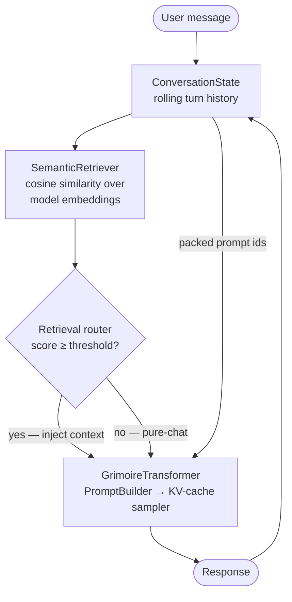

# Grimoire

**Grimoire** is a hybrid small language model (SLM) engine built entirely from scratch, designed to run on consumer hardware with optional GPU acceleration. It pairs a semantic retrieval engine with a scratch-built transformer LLM — the retrieval engine grounds answers in your corpus, the LLM provides coherent conversational language, and a retrieval-score router decides per-query whether grounding is needed or the model should answer from its own knowledge.

Grimoire is intentionally domain-agnostic. Agents are named configurations: each agent declares its corpus, its checkpoint, and its generation defaults. The engine stays the same.

The first agent built on Grimoire is **Saga**: a focused domain chatbot covering Dungeons & Dragons rules, encounter mathematics, and probability / data science.

## Goals

- Run on consumer hardware (CPU or CUDA GPU — no cloud required)
- Grounded domain facts from semantic retrieval; coherent conversation from the LLM
- Automatic routing: only inject corpus context when retrieval finds a confident match
- Full conversational coherence with multi-turn context tracking
- Modular: swap corpora, agents, and checkpoints independently
- One model powers both retrieval and generation — no separate embedding server
- Built from scratch as a learning project: tokenizer, transformer, training loop, and fine-tuning pipeline are all hand-written

## Repository Structure

```
grimoire/
├── grimoire_ai/
│   ├── agents/             # Agent registry — loads agents.json, builds InferenceEngine
│   ├── corpus/             # Corpus ingestion, stemming, n-gram index, Jaccard retrieval
│   ├── llm/                # Scratch-built transformer LLM
│   │   ├── tokenizer/      # Byte-level BPE tokenizer (vocab size 16 384)
│   │   ├── model/          # Decoder-only transformer (GQA, RoPE, SwiGLU, RMSNorm)
│   │   ├── data/           # TokenizedDataset, PaddingCollator, ConversationDataset
│   │   ├── training/       # Trainer, checkpointing, pretrain + finetune entry points
│   │   └── inference/      # PromptBuilder, KV-cache sampler, InferenceEngine, SemanticRetriever
│   ├── state/              # ConversationState — rolling multi-turn history + prompt build
│   ├── cli/                # Interactive terminal chat loop
│   └── ui/                 # Gradio app — Pre-train, Fine-tune, Ingest, Chat tabs
├── agents.json             # Named agent configurations (checkpoint, vocab, corpus, gen defaults)
├── scripts/
│   ├── build_saga_corpus.py        # Download D&D 5e SRD + copy math references
│   ├── finetune_saga.py            # Fine-tune a checkpoint on the Saga dataset
│   ├── validate_finetune_data.py   # Pre-flight check on any JSONL dataset
│   ├── finetune_data/
│   │   └── saga_v1.jsonl           # 30 Q&A examples (D&D rules, encounter math, probability)
│   └── saga_references/            # Hand-authored math/probability reference .txt files
├── docs/                   # Setup guides (training, inference)
├── data/                   # Runtime data — gitignored (corpus bins, tokenizer, checkpoints)
│   ├── raw/                # Source .txt files for pre-training corpus
│   ├── processed/          # Tokenised corpus.bin
│   ├── tokenizer/          # bpe.json — trained BPE vocabulary
│   ├── corpus/
│   │   └── saga/           # Populated by scripts/build_saga_corpus.py
│   └── finetune/           # Any additional fine-tuning datasets
├── checkpoints/            # Saved model checkpoints — gitignored
└── tests/                  # unit tests + integration tests — all green
```

## Architecture

### Flow



### How the hybrid works

Every user query is embedded by the same transformer that will generate the reply. That embedding is compared against pre-indexed corpus passage vectors (also embedded by the same model). If the top match exceeds the **retrieval threshold**, the passage is injected into the prompt as grounding context before generation. If no passage clears the threshold — because the query is conversational rather than domain-factual — the model answers from its own knowledge, without cluttering the prompt.

Both halves run the same model, in the same learned representation space. There is no separate embedding server and no external vector database.

### Component Table

| Component | Role | Status |
|---|---|---|
| **BPE Tokenizer** | Byte-level Byte-Pair Encoding; vocab 16 384; lossless round-trip for any Unicode | ✓ done |
| **Corpus Engine** | Ingests text, indexes stemmed 4-gram multi-tokens, retrieves top-k passages by Jaccard similarity (lexical fallback) | ✓ done |
| **Semantic Retriever** | Chunks documents into passages, embeds each with the model's own representations, and ranks by cosine similarity — the primary retrieval path | ✓ done |
| **Retrieval Router** | Compares the top retrieval score against a configurable threshold; routes to grounded or pure-chat generation per query | ✓ done |
| **Corpus Scraper** | `ingest()` dispatcher for web URLs (HTML + Markdown), PDFs, DOCX, Markdown files, plain text, and images (OCR) | ✓ done |
| **GrimoireTransformer** | Scratch-built decoder-only transformer (~25 M params); GQA, RoPE, SwiGLU, RMSNorm, weight-tied output head; `embed()` for sentence embeddings | ✓ done |
| **Training Pipeline** | AdamW + cosine-warmup LR, fp16 AMP, Flash Attention (SDPA), torch.compile, gradient accumulation, checkpointing | ✓ done |
| **Instruction Fine-tuning** | `ConversationDataset` on `{user, assistant, context?}` JSONL; response-only loss masking | ✓ done |
| **Inference Engine** | PromptBuilder (corpus → prompt), KV-cache autoregressive sampler (temperature / top-k / top-p / repetition penalty), `respond()`, `chat()`, `chat_stream()`, `embed()`, `build_semantic_corpus()` | ✓ done |
| **KV-Cache** | Caches K/V projections: O(n²) → O(1) per generation step; sliding-window truncation at `max_seq_len` | ✓ done |
| **Conversation State** | `ConversationState` packs rolling history newest-first within the token budget, then fills remaining space with corpus context | ✓ done |
| **Training UI** | Gradio app: Pre-train, Fine-tune, Ingest, and Chat tabs with live loss streaming | ✓ done |
| **Agent Registry** | `AgentRegistry` reads `agents.json`; `build_engine(key)` returns a ready `InferenceEngine` with corpus auto-loaded | ✓ done |
| **Saga Corpus** | 24 D&D 5e SRD sections + 4 hand-authored math/probability reference files; built by `scripts/build_saga_corpus.py` | ✓ done |
| **Saga Fine-tune Dataset** | 30 Q&A examples (D&D rules, encounter math, probability) in `scripts/finetune_data/saga_v1.jsonl` | ✓ done |
| **Integration Tests** | End-to-end: BPE train → corpus build → model pretrain → checkpoint → engine load → multi-turn `chat()` | ✓ done |

### Multi-turn prompt format

```
<BOS> [<SEP> {corpus context} <SEP>] <USR> q1 <AST> a1
                                     <USR> q2 <AST> a2
                                     …
                                     <USR> current query <AST>
```

History is packed newest-first within the token budget. When retrieval clears the threshold, the corpus context fills whatever space remains after history. If the budget is exhausted the oldest turns are dropped first, then the context is trimmed. The current query is always preserved.

### Why Hybrid

| Approach | Strength | Weakness |
|---|---|---|
| LLM alone | Fluent, coherent, conversational | Hallucinates domain facts; expensive to specialise |
| Corpus alone | Accurate, deterministic, explainable | Cannot track context or produce natural sentences |
| **Grimoire (hybrid)** | Grounded facts when the corpus is relevant + coherent language always + pure-chat when it isn't | Slightly more complex setup |

New domain knowledge requires only adding `.txt` files to the corpus — no retraining. Because retrieval uses the model's own embeddings, the index improves as training progresses.

### LLM Architecture

The transformer uses four improvements over the GPT-2 baseline:

| Technique | Replaces | Benefit |
|---|---|---|
| **RMSNorm** | LayerNorm | Removes mean-centering; marginally faster, equally stable |
| **RoPE** | Learned positional embeddings | Encodes relative position via rotation; zero extra parameters |
| **SwiGLU** | GELU feed-forward | Gated activation; consistently outperforms GELU at equal parameter budget |
| **Grouped Query Attention** | Multi-head attention | `n_kv_heads=2` vs `n_heads=8`; 4× smaller KV cache at inference |

Default configuration: `vocab_size=16384`, `d_model=512`, `n_layers=6`, `n_heads=8`, `n_kv_heads=2`, `d_ff=1408`, `max_seq_len=1024` → ~25 M parameters, ~100 MB fp32.

Training optimisations active: Flash Attention (SDPA), `torch.compile`, `cudnn.benchmark`, non-blocking GPU transfers.

## Agents

### Saga

Saga is the first Grimoire agent. It focuses on:

- **D&D 5e rules**: conditions, classes, spells, monsters, combat mechanics — sourced from the CC-BY 4.0 Systems Reference Document
- **Encounter mathematics**: XP budgets, CR scaling, multipliers, action economy
- **Probability & statistics**: dice distributions, DPR calculations, hit probabilities, death save odds

**Setup:**

```bash
# 1. Build the Saga corpus (downloads D&D 5e SRD ~1.5 MB, takes ~30 s)
python scripts/build_saga_corpus.py

# 2. Pre-train a model (or use an existing checkpoint)
python -m grimoire_ai.llm.training.train

# 3. Validate the fine-tuning dataset
python scripts/validate_finetune_data.py \
    --data  scripts/finetune_data/saga_v1.jsonl \
    --vocab data/tokenizer/bpe.json

# 4. Fine-tune on the Saga dataset
python scripts/finetune_saga.py \
    --checkpoint checkpoints/pretrain/step_XXXXXXX.pt \
    --vocab      data/tokenizer/bpe.json

# 5. Update agents.json with the fine-tuned checkpoint path, then load
#    Saga from the Chat tab dropdown in the UI.
python -m grimoire_ai.ui
```

## Usage

### Ingest a corpus source

```bash
# Web page (HTML)
python -m grimoire_ai.corpus.ingest --source https://example.com/rules --output data/raw/

# Raw Markdown URL (e.g. GitHub) — detected automatically, no HTML parsing
python -m grimoire_ai.corpus.ingest --source https://raw.githubusercontent.com/user/repo/main/doc.md --output data/raw/

# Local file (PDF, DOCX, Markdown, plain text)
python -m grimoire_ai.corpus.ingest --source docs/phb_excerpt.pdf --output data/raw/

# Directory (batch)
python -m grimoire_ai.corpus.ingest --source docs/ --output data/raw/ --recursive
```

Or from the **Ingest** tab in `python -m grimoire_ai.ui`.

### Pre-process corpus for training

```bash
python -m grimoire_ai.llm.data.preprocessing \
    --input  data/raw/ \
    --output data/processed/corpus.bin \
    --vocab  data/tokenizer/bpe.json
```

### Pre-train

```bash
python -m grimoire_ai.llm.training.train
# or via UI:  python -m grimoire_ai.ui  → Pre-train tab
```

### Fine-tune

```bash
python -m grimoire_ai.llm.training.finetune \
    --resume  checkpoints/step_0010000.pt \
    --data    data/finetune/examples.jsonl \
    --vocab   data/tokenizer/bpe.json \
    --output  checkpoints/finetune/
# or via UI:  python -m grimoire_ai.ui  → Fine-tune tab
```

### Chat (terminal)

```bash
# Ungrounded
python -m grimoire_ai.cli.chat \
    --checkpoint checkpoints/finetune/step_0000500.pt \
    --vocab      data/tokenizer/bpe.json

# Semantic retrieval with routing threshold
python -m grimoire_ai.cli.chat \
    --checkpoint         checkpoints/finetune/step_0000500.pt \
    --vocab              data/tokenizer/bpe.json \
    --corpus-dir         data/corpus/saga/ \
    --semantic \
    --retrieval-threshold 0.0
```

Commands: `/clear` (reset history), `/history` (review turns), `/quit`.

### Chat (Python API)

```python
from grimoire_ai.llm.inference.engine import InferenceEngine
from grimoire_ai.state.conversation import ConversationState

engine = InferenceEngine(
    checkpoint_path="checkpoints/finetune/step_0000500.pt",
    tokenizer_path="data/tokenizer/bpe.json",
)
# Build a semantic corpus and attach it; set a routing threshold.
engine.build_semantic_corpus(
    [("data/corpus/saga/srd.txt", "srd")],  # (text, source) tuples
)
engine.retrieval_threshold = 0.0  # route to pure-chat when no passage clears 0.0

state = ConversationState()
r1 = engine.chat("What happens when a creature is grappled?", state)
r2 = engine.chat("How do I escape the grapple?", state)  # model sees prior turn
```

### Load a named agent (Python API)

```python
from grimoire_ai.agents.registry import AgentRegistry

registry = AgentRegistry("agents.json")
engine = registry.build_engine("saga")  # loads checkpoint + corpus from agents.json
```

### Training UI

```bash
pip install -e ".[ui]"
python -m grimoire_ai.ui
# open http://localhost:7860
```

Six tabs: **Preprocess**, **Pre-train** (with model size presets), **Fine-tune**, **Ingest** (multi-file upload), **Chat** (streaming responses, corpus directory, semantic toggle, retrieval threshold slider, dataset builder), **Scale** (Chinchilla scaling calculator).

## Development

```bash
pip install -e ".[dev]"
pytest                            # unit tests
pytest tests/test_integration.py  # end-to-end integration tests
```

See [docs/setup-training.md](docs/setup-training.md) and [docs/setup-inference.md](docs/setup-inference.md) for detailed setup guides.

## References

- Granville, V. (2026). *LLMs Without Deep Neural Networks — New Architecture, Benefits & Case Study*. BondingAI.io.
- Granville, V. (2026). *No-Blackbox, Secure, Efficient AI and XLLM Solutions*. MLT.
- Zhang, B. & Sennrich, R. (2019). *Root Mean Square Layer Normalization*. NeurIPS.
- Su, J. et al. (2021). *RoFormer: Enhanced Transformer with Rotary Position Embedding*. arXiv.
- Shazeer, N. (2020). *GLU Variants Improve Transformer*. arXiv.
- Ainslie, J. et al. (2023). *GQA: Training Generalised Multi-Query Transformer Models from Multi-Head Checkpoints*. EMNLP.
- Loshchilov, I. & Hutter, F. (2019). *Decoupled Weight Decay Regularization*. ICLR.
