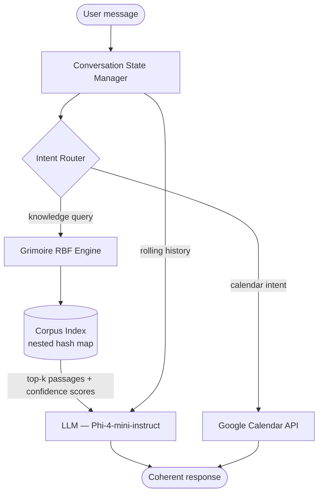

# Grimoire

**Grimoire** is a hybrid small language model (SLM) engine designed to run efficiently on CPU. It pairs dr. Vincent Granville's Radial Basis Function (RBF) interpolator; a no-training, exact retrieval method - with a small quantized LLM for coherent, context-aware response generation. The result is an agent engine that is accurate, explainable, and computationally lean enough to run on a home machine.

The first agent built on Grimoire is **Saga**: a domain-specialized chatbot and virtual assistant covering Dungeons & Dragons, mathematics, and data science, with Google Calendar integration for appointment awareness.

## Goals

- Run entirely on CPU — no GPU required
- Zero training cost for domain knowledge (RBF retrieves analytically, one-shot)
- Full conversational coherence with multi-turn context tracking
- Modular engine: swap corpora, agents, and tool integrations independently
- Deterministic, explainable retrieval grounded in a defined corpus — no hallucination on domain facts

## Repository Structure

```
grimoire/
├── grimoire/               # Core engine
│   ├── corpus/             # Corpus ingestion, stemming, multi-token indexing
│   ├── rbf/                # Granville RBF interpolator (retrieval engine)
│   ├── llm/                # LLM interface (llama.cpp / ollama)
│   ├── state/              # Conversation state and rolling history management
│   ├── router/             # Intent detection and tool routing
│   └── tools/              # Tool integrations (Google Calendar API, etc.)
├── agents/
│   └── saga/               # Saga agent — D&D, math, data science, calendar
├── data/                   # Corpus data files
├── tests/                  # Test suite
└── docs/                   # Architecture and API documentation
```

## Architecture

### Flow



### Component Roles

| Component | Role |
|---|---|
| **RBF Engine** | Granville's exact RBF interpolator — retrieves relevant corpus passages analytically, no gradient training needed |
| **Corpus Index** | Nested hash map of stemmed multi-tokens; replaces a vector database |
| **LLM** | Small quantized model (Phi-4-mini-instruct, ~2.2 GB Q4) — generates coherent responses grounded in retrieved passages |
| **Conversation State Manager** | Maintains rolling conversation history; injects full context into each LLM call |
| **Intent Router** | Detects calendar intents and routes to Google Calendar API; falls through to RBF for all knowledge queries |

### Why Hybrid

The RBF and the LLM cover each other's weaknesses:

- **LLM alone** — fluent and coherent, but hallucinates domain facts and requires expensive fine-tuning to specialize
- **RBF alone** — accurate and deterministic, but cannot track conversational context or generate novel sentences
- **Together** — the RBF retrieves accurate, corpus-grounded passages; the LLM reads them and produces a coherent, context-aware response. No fine-tuning required.

## Agents

### Saga

Saga is the first Grimoire-based agent. It operates as both a domain chatbot and a personal assistant:

- **Knowledge domains**: Dungeons & Dragons rules and lore, mathematics, data science
- **Assistant features**: Google Calendar integration — reads appointments for two calendars to answer scheduling questions
- **Design principle**: corpus-grounded answers only. Saga will say it does not know rather than guess.

## Usage (planned)

```python
from grimoire import GrimoireEngine
from agents.saga import Saga

engine = GrimoireEngine(
    corpus=["data/dnd.txt", "data/math.txt", "data/datasci.txt"],
    model="phi-4-mini-instruct",
)

saga = Saga(engine=engine)
response = saga.chat("What happens when you grapple a creature larger than you?")
print(response)
```

## References

- Granville, V. (2026). *LLMs Without Deep Neural Networks — New Architecture, Benefits & Case Study*. BondingAI.io.
- Granville, V. (2026). *No-Blackbox, Secure, Efficient AI and XLLM Solutions*. MLT.
